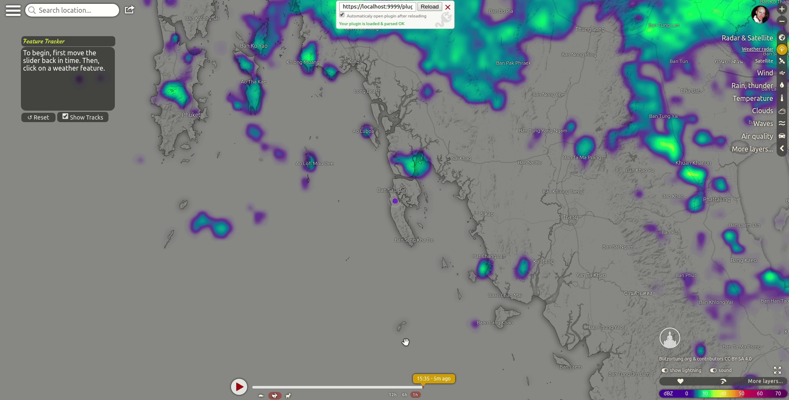

# windy-plugin-featuretracker
#### A plugin for Windy.com

Written by John C. Kealy, November 2019

### Description
Some weather features are too small in scale to be explicitly modelled by a numerical weather prediction model. One of the most important of these is convective precipitation, since these features can sometimes lead to torrential downpours, lightning, severe turbulence, squalls, and heavy snow. Convective cells form randomly below the grid-scale of the model; the individual cells cannot be predicted, and so only radar and satellite observations in real-time can identify them.

This plugin is designed to estimate the arrival time of a user-identified weather feature. This process cannot be automated*, and it is important to understand the difference between modelled precipitation (such as that provided by ECMWF) and real time precipitation (as visualized by radar).   

### Getting started with windy-plugin-featuretracker

By default, the plugin will load with a radar overlay, zoomed in over the user's location. The plugin requires that the user share their location in order for it to work. A guidance panel will open in the top left of the screen.

First, you must send the time slider backwards, ideally to the start of the allowed period. Next, identify a feature you would like to track, and click on it. You can click the centre of the feature or the edge, depending on your interest.

Initially, a rough estimate of the feature's ETA will be provided, if the trajectories match. This is based on the model 700hPa winds, a useful indicator of thunderstorm movement. However, this first guess is exactly that – just a rough guess.

Move the time slider forward and click on the same feature. You can do this as many times as you like. Each time, the estimate of arrival for your feature will be refined.

### Details of functionality

When two points or more have been entered into the map, a red polyline will be generated. This line is based on a least squares fit of your entered points (so the polyline will not necessarily pass through each point entered). The reason for this is that the plugin is based on the fundamental assumption that each feature will move in a straight line. The coriolis force curves features when the scale is large enough (which is why large weather systems spin), but at the scale of convection, the coriolis influence is relatively weak.

A magenta line will also appear, this is joins the first entered point to the user's location. The difference between the slope of these two curves (offset by a distance correction) determines whether the user is in the feature's path.

Reset the map at any time by clicking the "Reset" button, and hide/show the polylines with the "Show Track" checkbox.

#### Other notes

Some Windy functionality will close the feature-tracker's dialogue box (e.g. this happens when a spot forecast is opened). If this happens, simply right click the map and reselect the plugin.  

The plugin can be used with the satellite overlay. Please bear in mind that satellites view the atmosphere from above, which means that the upper-level flow will be most apparent. It is not uncommon for the upper-level flow to be travelling in a totally different direction to the lower atmosphere, at a totally different speed.

 

*Machine learning may someday change this.
